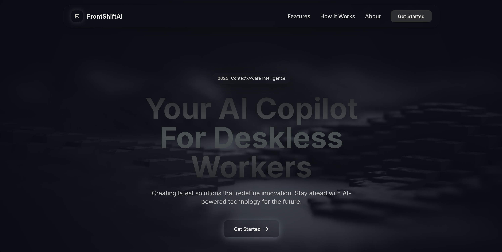

# FrontShiftAI



**AI Concierge for the Deskless Workforce**

    

**Team Members**: Harshitkumar Brahmbhatt, Krishna Venkatesh, Raghav Gali, Rishi Raj Kuleri, Sujitha Godishala, Swathi Baba Eswarappa

---

## 🎥 Video Demo


[](https://drive.google.com/drive/folders/1-BDy_7jMf0nWLNDfPSK6pi_NX8RqyYpC?usp=sharing)

---

## 📖 Abstract

**FrontShiftAI** is an enterprise-grade, multi-agent artificial intelligence platform designed to bridge the "HR gap" for deskless workers—nurses, construction foremen, and field technicians who lack access to traditional corporate portals. By functioning as a **24/7 Operations Concierge**, the system ingests thousands of pages of static organizational handbooks and transforms them into an interactive, actionable voice and chat interface.

Unlike standard chatbots, FrontShiftAI operates as a **Multi-Tenant System of Agents**. It doesn't just answer questions; it intelligently orchestrates complex workflows—verifying PTO balances, scheduling HR meetings, and searching the open web for real-time operational data—all while maintaining strict data isolation across 19+ distinct organizations.

---

## 🔗 Deployment Access

| Component | Provider | URL |
|-----------|----------|-----|
| **Frontend App** | **Vercel** ( Recommended) | [https://frontshiftai.vercel.app/](https://frontshiftai.vercel.app/) |
| **Frontend App** | Cloud Run | [https://frontshiftai-frontend-vvukpmzsxa-uc.a.run.app](https://frontshiftai-frontend-vvukpmzsxa-uc.a.run.app) |
| **Backend API** | Cloud Run | [https://frontshiftai-backend-vvukpmzsxa-uc.a.run.app/docs](https://frontshiftai-backend-vvukpmzsxa-uc.a.run.app/docs) |

---

## 📚 Documentation

Detailed guides for every subsystem are available in their respective directories:

| Documentation | Description | Link |
|---------------|-------------|------|
| **Cloud Deployment** | Infrastructure setup, CI/CD, Secrets, and Cost Analysis | [Deployment README](./deployment/README.md) |
| **Backend Architecture** | API internals, LangGraph agents, and Services | [Backend README](./backend/README.md) |
| **Frontend Architecture** | Component hierarchy, Design System, UX flows | [Frontend README](./frontend/README.md) |
| **Data Pipeline** | Ingestion logic, OCR, Embedding generation | [Data Pipeline README](./data_pipeline/README.md) |
| **ML Pipeline** | RAG evaluation, DeepEval framework | [Chat Pipeline README](./chat_pipeline/README.md) |
| **Monitoring** | W&B tracking, Cloud Logging, and Alerts | [Monitoring README](./monitoring/README.md) |

---

## 📁 Repository Structure

```
FrontShiftAI/
├── .github/
│   └── workflows/
│       ├── deploy-backend.yml      # 🚀 Production Deployment (Cloud Run)
│       ├── deploy-frontend.yml     # 🚀 Frontend Deployment
│       └── model_deploy.yml        # 🤖 ML Pipeline CI/CD Tests
│
├── backend/
│   ├── api/                        # 📡 REST API Layer (FastAPI)
│   │   ├── admin.py                # Admin Dashboard Endpoints
│   │   ├── auth.py                 # JWT Authentication & Login
│   │   ├── unified_agent.py        # 🧠 Main Chat Router (The "brain" of the chat)
│   │   ├── health.py               # Kubernetes/Cloud Run Health Checks
│   │   └── ... (agent specific routes)
│   │
│   ├── agents/                     # 🤖 LangGraph Agent Definitions
│   │   ├── pto/                    # PTO Transactional Logic
│   │   ├── hr_ticket/              # HR Ticketing Workflow
│   │   ├── website_extraction/     # Brave Search Integration
│   │   └── evaluation/             # DeepEval Agent Tests
│   │
│   ├── db/                         # 💾 Database Layer
│   │   ├── models.py               # SQLAlchemy Tables (Users, Tickets, PTO)
│   │   ├── session.py              # PostgreSQL Session Management
│   │   └── seed.py                 # Initial Data Factory
│   │
│   ├── services/                   # ⚙️ Shared Business Logic
│   │   ├── auth_service.py         # Password Hashing & Token Gen
│   │   └── rag_service.py          # Vector Search Abstraction
│   │
│   ├── monitoring/                 # 📊 Observability
│   │   └── middleware.py           # W&B Request Interceptor
│   │
│   └── main.py                     # 🏁 APPLICATION ENTRY POINT
│                                   # - Initializes FastAPI
│                                   # - Warmups (Preloads ChromaDB & Models)
│                                   # - Mounts Middlewares (CORS, Monitoring)
│
├── frontend/                       # ⚛️ React Application (Vite)
│   ├── src/
│   │   ├── components/             # UI Building Blocks
│   │   ├── services/               # Axios API Clients
│   │   ├── hooks/                  # Custom React Hooks
│   │   └── App.jsx                 # Main Router & Layout
│
├── data_pipeline/                  # 🏭 Data Factory (ETL)
│   ├── data/
│   │   ├── raw/                    # 📥 Input: PDF Handbooks
│   │   └── vector_db/              # 📤 Output: ChromaDB Artifacts
│   ├── scripts/
│   │   ├── ingestion.py            # OCR & Text Extraction
│   │   ├── embedding.py            # HuggingFace Vectorization
│   │   └── validation.py           # Data Quality Checks
│   └── airflow/                    # (Optional) DAG Definitions
│
├── chat_pipeline/                  # 🔬 Research Lab (MLOps)
│   ├── rag/                        # Core RAG Algorithms
│   │   ├── retriever.py            # Semantic Search Logic
│   │   └── generator.py            # LLM Prompt Engineering
│   └── evaluation/                 # Test Suites
│       └── test_groundedness.py    # Hallucination Detection
│
├── deployment/                     # ☁️ Infrastructure as Code
│   ├── README.md                   # 📖 Deployment Guide & Specs
│   ├── Dockerfile.backend          # Multi-stage Python Build
│   └── Dockerfile.frontend         # Nginx Static Build
│
├── docker-compose.yml              # 🐳 Local Development Orchestration
└── system_diagram.png              # 📐 Architecture Visualization
```

---

## 🚀 Key Features

- **Unified Agent Router**: Intelligently discerns user intent to route requests to the specialized sub-agent (RAG, PTO, or Ticket).
- **RAG "Librarian"**: Retrieval-Augmented Generation pipeline grounded in company handbooks, providing page-level citations.
- **Transactional Agents**:
    - **PTO Agent**: Checks balances, validates holiday logic, and commits leave requests.
    - **Website Agent**: Automatic fallback to Brave Search for "live" data (e.g., "Is the office open today?").
- **Multi-Tenancy**: Single deployment serving 19+ distinct companies with complete data isolation.
- **Monitoring Suite**: Real-time dashboards visualizing Token Usage, Latency, and Agent Accuracy via **Weights & Biases**.
- **Secure Infrastructure**: Zero-trust security model with Workload Identity and Secret Manager integration.

---

## 🏗️ Cloud Deployment Architecture

The system is architected as a serverless microservices application on **Google Cloud Platform (GCP)**.

### Infrastructure Components
For a detailed breakdown of all resources, see the [Deployment Guide](./deployment/README.md#cloud-resources-inventory).

| Component | Service | Role |
|-----------|---------|------|
| **Compute** | **Cloud Run** | Runs the Backend (FastAPI) and Frontend (React/Nginx) containers. Scales to zero to minimize costs. |
| **Database** | **Cloud SQL** | Managed PostgreSQL 15 instance storing user data, PTO requests, ticket queues, and relational state. |
| **Vector Store** | **ChromaDB + GCS** | Local vector database loaded into memory from Google Cloud Storage on container startup. |
| **Security** | **Secret Manager** | Injects API keys (`GROQ`, `MERCURY`) and DB credentials at runtime. |
| **Backups** | **Automated** | Daily backups of SQL data (3 AM UTC); Immutable artifact versioning for Vector DBs. |

### System Diagram


---

## 🛠️ Technical Stack

### Core Application
- **Backend Language**: Python 3.12 (AsyncIO)
- **Frontend Framework**: React 18 (Vite, TypeScript, Tailwind CSS)
- **API Framework**: FastAPI
- **Database**: PostgreSQL 15 (SQLAlchemy ORM)

### AI & Machine Learning
- **Orchestration**: LangGraph (Multi-Agent State Machine)
- **Vector Database**: ChromaDB (Persistence via GCS)
- **Embeddings**: HuggingFace (`all-MiniLM-L6-v2`)
- **LLM Providers**: 
  - **Inception/Mercury**: Primary Generation
  - **Groq (Llama 3)**: Fallback & Reasoning
- **Evaluation**: DeepEval, Weights & Biases

### DevOps & Infrastructure
- **Containerization**: Docker (Multi-stage builds)
- **CI/CD**: GitHub Actions (Workload Identity Federation)
- **Cloud**: GCP (Cloud Run, Cloud SQL, GCS, Secret Manager)

---

## 💾 Data Usage

The system acts as a knowledge engine for organizational data.
1.  **Ingestion**: `data_pipeline` scripts ingest raw PDF handbooks (~50-100 pages each).
2.  **Processing**: OCR (Tesseract) extracts text, which is then chunked into 500-token semantic segments.
3.  **Vectorization**: Chunks are embedded and stored in a shared **ChromaDB** index, partitioned by `company_id`.
4.  **Storage**: The final vector artifact (~500MB) is compressed and stored in Cloud Storage, ensuring stateless application containers.

---

## 📊 Monitoring & Testing

### Monitoring Strategy
We utilize a dual-layer strategy to ensure reliability:
1.  **Infrastructure Level**: Google Cloud Monitoring tracks container latency, error rates (5xx), and CPU/Memory usage.
2.  **Application Level**: **Weights & Biases (W&B)** traces every LLM interaction, logging:
    - Token consumption and Cost per request.
    - Agent routing accuracy (Did the router pick the right tool?).
    - User feedback signals (Thumbs up/down).

### Testing Protocol
- **Unit Tests**: `pytest` suite ensuring agent logic validity (`backend/tests`).
- **Integration Tests**: Dockerized flows verifying SQL and Vector DB connectivity.
- **Bias Analysis**: Automated scripts in `data_pipeline` measuring response handling across different demographic terminologies.

---

## ⚖️ Fairness & Bias Mitigation

We actively monitor for **Representation Bias** to ensure equitable performance across all 19+ tenant organizations, regardless of their size or industry.

### 1. Data Bias Analysis
- **Metric**: Gini Coefficient of Handbook Volume.
- **Current Score**: **0.250** (Low Imbalance).
- **Finding**: While some companies have larger handbooks (e.g., *Buchheit Logistics* with ~13% of total data), the distribution remains healthy. No company suffers from "data poverty" (<10 chunks).

### 2. Performance Proxies & Mitigation strategies
| Risk Type | Indicator | Mitigation Strategy |
| :--- | :--- | :--- |
| **Retrieval Confusion** | Large Handbooks (>80 chunks) | **Adaptive Retrieval**: Increased `top_k` (6-8) to filter "distractor" chunks. |
| **Hallucination** | Sparse Handbooks (<20 chunks) | **Confidence Thresholds**: Strict gating; Agent returns "I don't know" rather than inventing policy. |
| **Term Frequency** | "Harassment" tag dominance (151x) | **Tag Enrichment**: Fine-tuning extraction agents to recognize niche policy categories. |

*For a detailed report, see [Company Bias Analysis](./docs/company_bias_analysis.md).*

---

## 💰 Cost Analysis (Monthly Estimate)

Designed for student-budget constraints (Free Tier capable).

| Service | Configuration | Est. Monthly Cost |
|---------|---------------|-------------------|
| **Cloud SQL** | `db-f1-micro` | ~$10.00 |
| **Cloud Run** | Scale-to-Zero | ~$2.00 |
| **Cloud Storage** | Standard (<1GB) | < $0.10 |
| **LLM APIs** | Groq/Mercury (Free Tiers) | $0.00 |
| **Total** | | **~$12.10** |

---

## ⚡ Installation & Contributing

### Prerequisites
- Python 3.10+
- Node.js 18+
- Docker (Optional but recommended)
- `gcloud` CLI (for deployment)

### Quick Start (Local Development)

1.  **Clone the Repo**
    ```bash
    git clone https://github.com/MLOpsGroup9/FrontShiftAI.git
    cd FrontShiftAI
    ```

2.  **Backend Setup**
    ```bash
    cd backend
    python -m venv venv && source venv/bin/activate
    pip install -r requirements.txt
    
    # Create .env file with your keys
    cp .env.example .env
    
    python main.py
    ```

3.  **Frontend Setup**
    ```bash
    cd frontend
    npm install
    npm run dev
    ```

4.  **Visit**: `http://localhost:3000` to interact with the local Concierge.

### Contributing
Please fork the repository and submit Pull Requests to the `main` branch. 
- Ensure `pytest` passes before submission.
- Update documentation if you modify infrastructure.

---

## 📜 License
Proprietary software developed by **MLOps Group 9** (Northeastern University).
