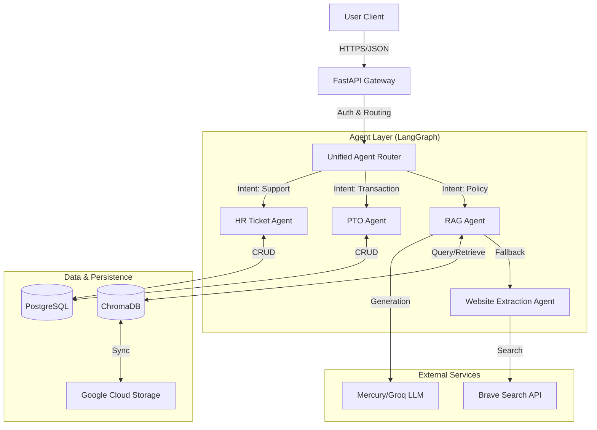
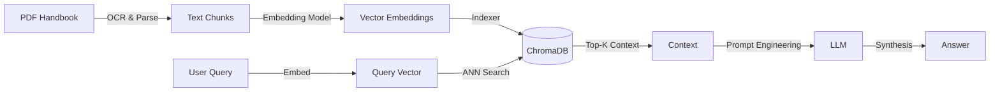

# FrontShiftAI Backend System

**Multi-Tenant RAG System with Intelligent Agent Workflows**

## Abstract

The FrontShiftAI backend is a sophisticated, multi-tenant Retrieval-Augmented Generation (RAG) system designed to provide enterprise-grade access to organizational knowledge. Built on **FastAPI** and **Python 3.12**, it orchestrates a suite of intelligent agents to handle complex user queries—from policy questions to HR transactions—across 19+ distinct organizations. The system distinguishes itself through a novel **Unified Agent Router** that seamlessly delegates tasks to specialized sub-agents (PTO, HR Ticket, RAG) or falls back to valid external sources (Website Extraction) when internal knowledge is insufficient. Core architectural components include **LangGraph** for stateful agentic workflows, **ChromaDB** for vector storage, and a robust MLOps pipeline featuring **Weights & Biases** for observability.

---

### 1.1 Quick Links
- **Local API**: [http://localhost:8000/docs](http://localhost:8000/docs)
- **Production API**: [https://frontshiftai-backend-vvukpmzsxa-uc.a.run.app/docs](https://frontshiftai-backend-vvukpmzsxa-uc.a.run.app/docs)
- **Monitoring (W&B)**: [https://wandb.ai/group9mlops-northeastern-university/FrontShiftAI](https://wandb.ai/group9mlops-northeastern-university/FrontShiftAI)

### 1.2 System Architecture

The backend architecture follows a microservices-inspired monolithic design, emphasizing modularity, scalability, and strict separation of concerns.

### 1.3 High-Level Data Flow



### 1.2 Core Components

- **FastAPI Gateway**: Handles HTTP requests, authentication (JWT), and centralized error handling.
- **Unified Agent Router**: A semantic routing layer that analyzes user intent to dispatch requests to the appropriate specialized agent.
- **LangGraph Engine**: Manages the state and control flow of complex, multi-step agent interactions (e.g., verifying PTO balances before submission).
- **Hybrid Data Layer**: Utilizes PostgreSQL for relational data (users, requests, tickets) and ChromaDB for high-dimensional vector embeddings of company handbooks.

---

## 2. Artificial Intelligence Layer

The system's intelligence is distributed across specialized agents, each designed with a specific cognitive scope and toolset.

### 2.1 Unified Agent Router ("The Concierge")
Instead of forcing users to select a specific "bot," the router acts as a natural language interface. It evaluates the semantic intent of a message and routes it accordingly.

**Fallback Architecture (The "Safety Net"):**
To minimize "I don't know" responses, the system implements a cascading fallback logic:
1.  **Specialist Agents**: Prioritized for transactional requests (PTO, Tickets).
2.  **RAG Agent**: Queries internal documentation (Employee Handbook).
3.  **Website Agent**: *Automatically* triggered if RAG fails, searching public company resources.
4.  **HR Ticket Suggestion**: Final fallback if no answer is found.

### 2.2 RAG Pipeline (Retrieval-Augmented Generation)

The RAG subsystem is responsible for grounding AI responses in fact-based company documents.



- **Embedding Model**: `sentence-transformers/all-MiniLM-L6-v2` (384 dimensions). Selected for its high speed-to-accuracy ratio on CPU-bound environments.
- **Vector Store**: **ChromaDB**. configured for persistence and optimized for multi-tenant filtering (metadata filtering by `company_id`).
- **Chunking Strategy**: Recursive character splitting with overlap to preserve semantic context across boundaries.

### 2.3 Agent Workflows (LangGraph)

We utilize **LangGraph** to define agents as specific **StateGraphs**. This allows for cyclic computational flows, essential for agents that need to "reason" or retry steps.

#### PTO Request Agent
Handles the logic-heavy process of requesting time off.
- **State**: Tracks `start_date`, `end_date`, `reason`, `balance_check_status`.
- **Logic**: Validates dates -> Checks PostgreSQL balance -> Creates DB Record -> Notifies Admin.

#### Website Extraction Agent
A novel fallback mechanism that searches real-time public data.
- **Trigger**: Activated when RAG confidence score < threshold.
- **Mechanism**: Parses query keywords -> Executes `site:` specific search via **Brave Search API** -> Scrapes and synthesizes top results.
- **Benefit**: seamlessly answers questions like "Office hours" or "Staff directory" that are often missing from static handbooks.

---

## 3. Technical Implementation Details

### 3.1 Tech Stack
| Component | Technology | Rationale |
|-----------|------------|-----------|
| **Framework** | FastAPI | High performance, native async support, auto-generated OpenAPI docs. |
| **Language** | Python 3.12 | Latest features, type hinting improvements. |
| **Orchestration** | LangGraph | Stateful, visibly graph-based agent orchestration. |
| **Database** | PostgreSQL | Robust relational integrity for ACID transactions. |
| **Vector DB** | ChromaDB | Open-source, easy to host, strong metadata filtering. |
| **LLM** | Mercury / Groq | Flexible provider switching for cost/performance optimization. |

### 3.2 MLOps & Observability
- **Weights & Biases (W&B)**: Used for tracing agent execution paths, logging LLM inputs/outputs, and monitoring token usage using `Weave`.
- **Celery & Redis**: Async task queue for long-running jobs like index rebuilding or bulk user ingestion.
- **Custom Metrics**: Latency tracking, error rate monitoring, and specific "agent usage" statistics.

### 3.3 Project Structure
The codebase follows a domain-driven structure:

```
backend/
├── agents/                     # LangGraph Agent Implementations
│   ├── pto/                    # PTO Agent (vacation logic)
│   ├── hr_ticket/              # HR Ticket Agent (Jira/Helpdesk logic)
│   ├── website/                # Website Extraction Agent (fallback search)
│   ├── rag/                    # RAG Agent (document retrieval)
│   ├── unified_agent.py        # Unified Agent Router (The "Concierge")
│   ├── agent_router.py         # Router Logic
│   ├── pto_agent.py            # PTO Logic
│   ├── hr_ticket_agent.py      # HR Ticket Logic
│   ├── rag.py                  # RAG Logic
│   ├── company_management.py   # Company Management Logic
│   ├── admin.py                # Admin Agent Logic
│   ├── auth.py                 # Authorization Logic
│   └── health.py               # Health Check Logic
├── api/                        # REST API Layer
│   ├── routes/                 # FastAPI Routers
│   │   ├── chat.py             # Chat endpoints
│   │   ├── auth.py             # Authentication endpoints
│   │   └── admin.py            # Administrative endpoints
│   └── deps.py                 # Dependency Injection (DB, User)
├── core/                       # Core configurations
│   ├── config.py               # Environment settings (Pydantic Settings)
│   └── security.py             # JWT & Password hashing
├── db/                         # Database Access
│   ├── models/                 # SQLAlchemy Models (User, Ticket, Request)
│   │   └── models.py           # DB Models definition
│   ├── connection.py           # DB Connection logic
│   ├── seed.py                 # Database Seeding script
│   └── migrations/             # Alembic versions
├── schemas/                    # Pydantic Schemas (Data Transfer Objects)
│   ├── chat.py                 # Chat request/response schemas
│   ├── user.py                 # User profile schemas
│   └── common.py               # Shared enums and types
├── services/                   # Business Logic Layer
│   ├── auth_service.py         # Login & Registration logic
│   └── chat_service.py         # Chat persistence logic
├── monitoring/                 # Observability
│   └── telemetry.py            # OpenTelemetry & W&B integration
├── jobs/                       # Background Tasks
│   └── celerey_worker.py       # Async task definitions
├── tests/                      # Pytest Suite
└── main.py                     # Application Entrypoint
```

---

## 4. Setup & Development

### Prerequisites
- Python 3.10+
- PostgreSQL (Local or Cloud)
- Environment keys: `GROQ_API_KEY`, `BRAVE_API_KEY`, `DATABASE_URL`

### Installation

```bash
# 1. Clone and navigate
git clone [repo]
cd backend

# 2. Virtual Environment
python -m venv venv
source venv/bin/activate  # Windows: venv\Scripts\activate

# 3. Dependencies
pip install -r requirements.txt

# 4. Environment Variables
cp .env.example .env
# Edit .env with your credentials
```

### Running the Application

**Development Server:**
```bash
python main.py
# Runs Uvicorn on http://localhost:8000
```

**Testing:**
The project maintains a comprehensive test suite (200+ tests) covering agents, API endpoints, and database logic.
```bash
pytest
```

---

## 5. API Documentation

Comprehensive documentation is automatically generated via Swagger UI.

- **Local**: `http://localhost:8000/docs`
- **Production**: `https://frontshiftai-backend-vvukpmzsxa-uc.a.run.app/docs`

### Key Endpoints
- `POST /api/chat/message`: Unified entry point for all agent interactions.
- `POST /api/auth/login`: JWT token generation.
- `GET /api/admin/monitoring/stats`: System health and performance metrics.

---

## License
Proprietary software developed for FrontShiftAI.