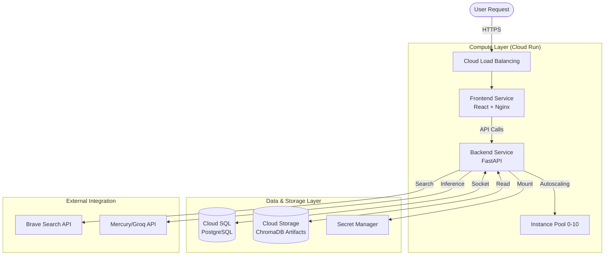

# FrontShiftAI Deployment & Infrastructure Guide

**Cloud-Native Deployment on Google Cloud Platform (GCP)**

## 📖 Abstract

This document details the production infrastructure, deployment pipeline, and security standard for FrontShiftAI. The system is deployed as a serverless containerized application on **Google Cloud Run**, orchestrated via **GitHub Actions**. It relies on **Cloud SQL**, **Cloud Storage**, and **Secret Manager** to provide a secure, auto-scaling environment.

---

## ☁️ Cloud Resources Inventory

We utilize 7 core Google Cloud Platform services to effect a serverless, auto-scaling architecture.

| Service | Resource Name | Role | Tier/Config |
|---------|---------------|------|-------------|
| **Cloud Run** | `frontshiftai-backend` | **Backend**: Hosts FastAPI, Agents, and RAG logic. | 2Gi RAM, 2 vCPU, Scale 0-10 |
| **Cloud Run** | `frontshiftai-frontend` | **Frontend**: Serves React static files via Nginx. | 512Mi RAM, 1 vCPU, Scale 0-10 |
| **Cloud SQL** | `frontshiftai-db` | **Database**: Managed PostgreSQL 15 for relational data. | `db-f1-micro` (Shared CPU) |
| **Cloud Storage** | `frontshiftai-data` | **Blob Store**: Hosts ChromaDB artifacts and PDF handbooks. | Standard Class (US Main) |
| **Secret Manager** | Multiple Keys | **Security**: Injects API keys and DB creds at runtime. | Automatic Replication |
| **Artifact Registry** | `frontshiftai-*` | **Registry**: Stores versioned Docker images. | Standard Docker Repository |
| **Cloud Monitoring** | `frontshiftai` | **Observability**: Logs, Metrics, and Latency tracking. | Standard Suite |

---

## 🏗️ System Architecture

### High-Level Data Flow



### Detailed Infrastructure Breakdown

#### 1. Serverless Compute (Cloud Run)
We operate two distinct services:
- **Backend (`frontshiftai-backend`)**:
    - **Runtime**: Python 3.12, FastAPI.
    - **Behavior**: Downloads the `chroma_db.tar.gz` vector store from GCS upon cold start (~30s latency).
    - **Scaling**: Configured to scale to zero when idle to minimize costs to $0.00.
- **Frontend (`frontshiftai-frontend`)**:
    - **Runtime**: Nginx Alpine serving React build artifacts.
    - **Behavior**: Lightweight static server, sub-second startup.

#### 2. Managed Database (Cloud SQL)
- **Engine**: PostgreSQL 15.
- **Connection**: Uses **Unix Sockets** (`/cloudsql/...`) for secure, low-latency connection from Cloud Run. No public IP is exposed.
- **Backup Strategy**: Automated daily backups at 3:00 AM UTC with 7-day retention.

#### 3. Vector Storage (Cloud Storage)
- **Bucket**: `frontshiftai-data`
- **ChromaDB Artifact**: The RAG system relies on a pre-computed vector index stored as `chroma_db.tar.gz`.
- **Lifecycle**: The Data Pipeline uploads new artifacts here; the Backend downloads them on startup. This decouples data updates from code deployments.

#### 4. Security (Secret Manager & IAM)
- **Zero-Trust**: No `.env` files or hardcoded keys.
- **Injection**: Secrets (`GROQ_API_KEY`, `DATABASE_URL`, etc.) are mounted as environment variables at runtime.
- **Workload Identity**: GitHub Actions authenticates via OIDC, eliminating the need for long-lived Service Account JSON keys.

---

## 🚀 CI/CD Pipeline

Deployment is fully automated via **GitHub Actions** using a GitOps workflow.

### The Pipeline Flow
Triggers on semantic pushes to `krishna-branch` / `main`.

```mermaid
sequenceDiagram
    participant Dev as Developer
    participant GH as GitHub Actions
    participant AR as Artifact Registry
    participant GCP as Cloud Run
    
    Dev->>GH: Push Code
    
    rect rgb(20, 20, 20)
        Note over GH: CI Phase
        GH->>GH: Run Pytest & Linting
        GH->>GH: Build Docker Image
    end
    
    rect rgb(40, 40, 40)
        Note over GH, GCP: CD Phase
        GH->>GCP: Auth via Workload Identity
        GH->>AR: Push Image to Registry
        GH->>GCP: Deploy Revision to Cloud Run
        GCP-->>GH: Success URL
    end
```



### Key Configuration Stats
- **Build Time**: ~2 minutes (Frontend), ~4 minutes (Backend).
- **Optimization**: Backend Dockerfile pre-downloads HuggingFace models (`all-MiniLM-L6-v2`) to prevent runtime timeouts.
- **Images**: Stored in Artifact Registry with 30-day retention policies.

---

## 💰 Cost Analysis (Monthly Estimate)

Designed for maximum efficiency, usually falling within the Google Cloud Free Tier.

| Service | Configuration | Est. Monthly Cost |
|---------|---------------|-------------------|
| **Cloud SQL** | `db-f1-micro` | ~$10.00 |
| **Cloud Run** | Scale-to-Zero | ~$2.00 |
| **Cloud Storage** | Standard (<1GB) | < $0.10 |
| **Artifact Registry** | ~1GB Images | $0.10 |
| **Total** | | **~$12.20 / mo** |

*Note: With the $300 GCP credit for new accounts, this architecture essentially runs free for 12+ months.*

---

## 🛡️ Disaster Recovery & Rollbacks

### Rollback Procedure
If a deployment introduces a critical bug, we can instantly rollback via CLI:

```bash
# 1. Identify the previous healthy revision
gcloud run revisions list --service=frontshiftai-backend --region=us-central1

# 2. Shift 100% traffic to that revision
gcloud run services update-traffic frontshiftai-backend \
  --to-revisions=frontshiftai-backend-00005-abc=100 \
  --region=us-central1
```

### Database Recovery
Cloud SQL provides Point-in-Time Recovery (PITR).
```bash
gcloud sql backups restore [BACKUP_ID] --backup-instance=frontshiftai-db
```

---

## 📜 License
Proprietary software developed for FrontShiftAI.