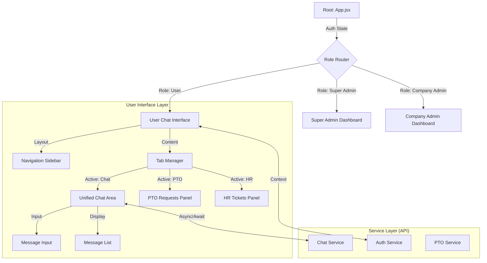

# FrontShiftAI Frontend

**Reactive User Interface for Multi-Tenant Intelligent Agent System**

## Abstract

The FrontShiftAI Frontend is a modern, high-performance single-page application (SPA) built with **React 18** and **Vite**. It serves as the visual orchestration layer for the multi-tenant RAG system, providing a seamless interface for users to interact with intelligent agents, manage time-off requests, and track HR support tickets. The application implements a sophisticated **Role-Based Access Control (RBAC)** system, ensuring secure data isolation and appropriate feature access for regular users, company administrators, and super administrators. The design philosophy centers on **"Glassmorphism"**, utilizing translucency and blurring to create a depth-rich, premium user experience.

---

## 1. System Architecture

The frontend is architected as a modular component hierarchy with a strict separation between presentation (Components) and data access (Service Layer).

### 1.1 Component Hierarchy & Data Flow



### 1.2 Key Architectural Patterns

- **Service Layer Pattern**: All API interactions are encapsulated in `src/services/api.js`. Components never make direct `fetch` or `axios` calls. This abstraction simplifies testing and allows for centralized error handling and interceptors (e.g., auto-injecting JWT tokens).
- **Role-Based Routing**: Dynamic rendering logic determines the widget tree based on the user's `role` claim in their JWT. This securely hides administrative interfaces from regular users at the client level.
- **Unidirectional Data Flow**: State is managed primarily through React Hooks (`useState`, `useEffect`) and passed down via props, ensuring predictable rendering behavior.

---

## 2. Design System & UX

The application's visual language is built on a custom **Tailwind CSS** configuration, implementing a "Glassmorphism" aesthetic to convey modernity and fluidity.

### 2.1 Aesthetic Principles

```css
/* Core Glass Effect */
.glass-card {
  @apply backdrop-blur-xl bg-white/10 border border-white/10 rounded-2xl;
  box-shadow: 0 8px 32px 0 rgba(31, 38, 135, 0.37);
}
```

- **Translucency**: UI cards use alpha-channel backgrounds (`bg-white/10`) with `backdrop-filter: blur(20px)` to create a frosted glass effect that adapts to the dynamic gradient backgrounds.
- **Micro-Interactions**: Elements feature subtle hover states (`scale-105`, `brightness-110`) and smooth transitions (`transition-all duration-300`) to provide tactile feedback.
- **Typography**: High-contrast, sans-serif typography ensures readability against complex backgrounds.

---

## 3. Core Features

### 3.1 Unified Chat Interface
The heart of the application is the chat interface, which abstracts the complexity of the underlying multi-agent system.
- **Real-time Streaming**: (Planned) Architecture supports streaming token responses for lower perceived latency.
- **Source Attribution**: RAG responses visually distinguish "citations" with clickable source links.
- **Agent Awareness**: The UI dynamically indicates which agent is active (e.g., "Answering via **PTO Agent**").

### 3.2 Administrative Dashboards
- **Company Admin**: Provides a localized view of organization-specific metrics, PTO approval queues, and staff lists.
- **Super Admin**: A global command center for provisioning new company tenants and monitoring system-wide health.

### 3.3 Monitoring Dashboard
A React-based visualization suite using **Recharts** to render real-time telemetry from the backend.
- Displays request latency distributions.
- Visualizes agent utilization rates (RAG vs. PTO vs. Website Extraction).

---

## 4. Technical Implementation

### 4.1 Technology Stack

| Category | Technology | Rationale |
|----------|------------|-----------|
| **Core** | React 18 | Concurrent features, massive ecosystem. |
| **Build Tool** | Vite | Extremely fast HMR (Hot Module Replacement) and optimized production builds. |
| **Styling** | Tailwind CSS | Utility-first CSS for rapid, consistent design system implementation. |
| **HTTP Client** | Axios | Rich feature set including interceptors for JWT management. |
| **Charts** | Recharts | Composable, reliable charting library for dashboards. |

### 4.2 Performance Optimization
- **Code Splitting**: Vite automatically chunks vendor libraries separately from application code.
- **Lazy Loading**: Route-based code splitting ensures admin dashboard bundles are not loaded for regular users.
- **Memoization**: `useMemo` and `useCallback` are employed in data-heavy views (like the Monitoring Dashboard) to prevent unnecessary re-renders.

---

## 5. Development & Deployment

### 5.1 Local Setup

```bash
# 1. Install dependencies
npm install

# 2. Environment Setup
cp .env.example .env
# Set VITE_API_URL=http://localhost:8000

# 3. Start Development Server
npm run dev
```

### 5.2 Production Build

The application is containerized using a multi-stage Docker build for optimal image size.

1.  **Build Stage**: Uses Node.js to compile the React assets (`npm run build`).
2.  **Runtime Stage**: Uses Nginx (Alpine) to serve the static assets.
3.  **Result**: A lightweight (~50MB) container ready for Cloud Run.

```dockerfile
# Simplified Dockerfile flow
FROM node:18-alpine as builder
RUN npm run build

FROM nginx:alpine
COPY --from=builder /app/dist /usr/share/nginx/html
```

---

## License
Proprietary software developed for FrontShiftAI.
