# FrontShiftAI - Monitoring & Observability Documentation

 
**Tools:** Google Cloud Monitoring + Weights & Biases (W&B)

---

## 1. General Implementation Overview

We have implemented a comprehensive monitoring strategy that covers both infrastructure health and application performance. This dual-layer approach ensures we can detect issues at the server level (e.g., high CPU, memory leaks) as well as the logic level (e.g., agent hallucinations, API latency).

### Key Components:
1.  **Infrastructure Monitoring (GCP)**: Focuses on the "health" of the underlying services like Cloud Run and Cloud SQL.
    *   **Goal**: Ensure 99.9% uptime and auto-scale effectively during load spikes.
    *   **Scope**: CPU, Memory, Network I/O, Disk usage, and Database connection pools.
2.  **Application Monitoring (Weights & Biases)**: Focuses on the "intelligence" and business logic.
    *   **Goal**: Validate the quality of AI responses and track business KPIs.
    *   **Scope**: Agent hallucinations, tool usage frequency, token consumption, and specific business outcomes (e.g., PTO approved).
3.  **Alerting**: Automated notifications via email when critical thresholds are breached (e.g., error rates > 10/min).

---

## 2. Weights & Biases Monitoring (Detailed)

Weights & Biases (W&B) is our primary tool for observing the behavior of our AI agents and the application logic. Unlike traditional logs which just say "error", W&B traces allow us to replay the exact conversation that led to a failure.

### 2.1 Overall System Health
The main dashboard provides a high-level view of the entire system's pulse. We track:
*   **System Metrics**: GPU/CPU usage of the inference server (if applicable) or the container handling the logic.
*   **Memory Usage**: Tracking RAM consumption to identify potential memory leaks in our Python application, specifically during heavy RAG processing.
*   **Disk I/O**: Monitoring read/write speeds, which is crucial for vector database lookups.

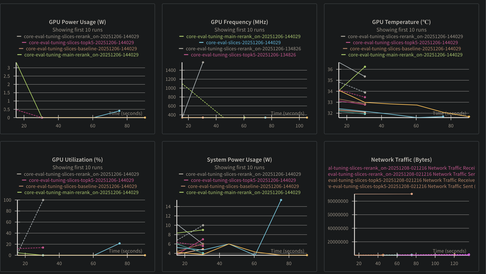
*Figure 2.1: System resources and high-level request tracking.*

### 2.2 Production Dashboard
This view focuses on production-specific metrics, separating dev/test traffic from real user interactions. It helps us correlate user activity with system load.
*   **Active Users**: Real-time count of unique users interacting with the system.
*   **Request Latency**: We track P50, P90, and P99 latency. reliable P99 latency is critical for user experience in chat applications.
*   **Tokens per Second**: A key metric for the LLM; drops in this metric indicate upstream provider (OpenAI/Gemini) latency or network bottlenecks.

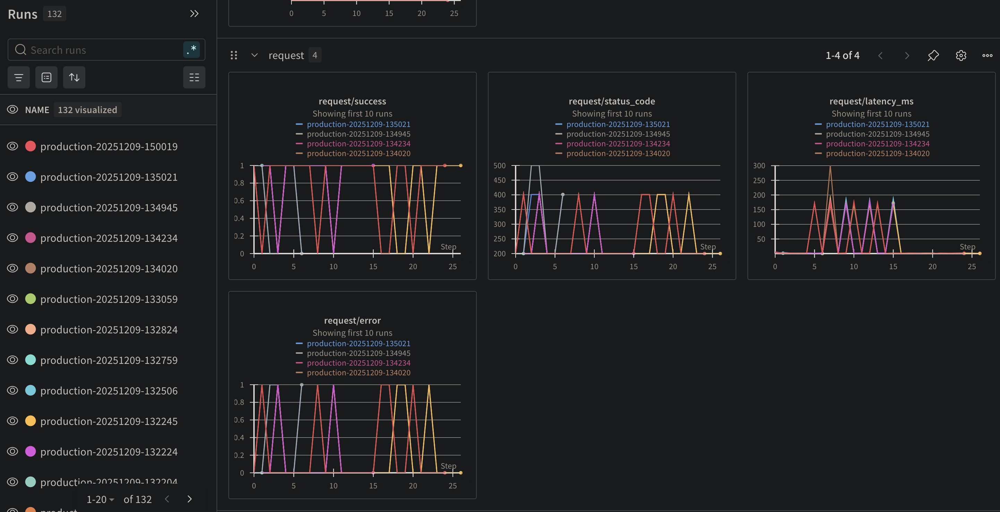
*Figure 2.2: Overall Production Dashboard showing active users and request success rates.*

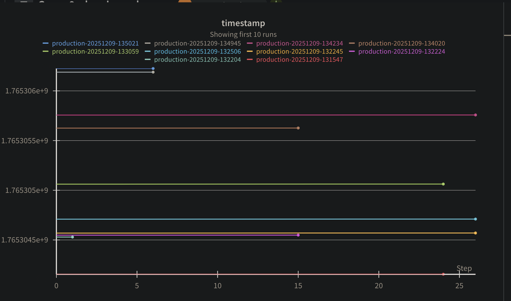
*Figure 2.3: Detailed metric breakdown for production traffic.*

### 2.3 Agent Evaluations
We have specific monitoring for each of our AI agents to ensure they are performing their specific tasks correctly.

#### Summary of Agents
A consolidated view of all agent performances. This allows us to compare:
*   **Success Rate by Agent**: Which agent fails the most?
*   **Cost per Agent**: Which agent consumes the most tokens?
*   **Latency by Agent**: Which agent is the slowest? (Usually RAG agents are slower than transactional agents).

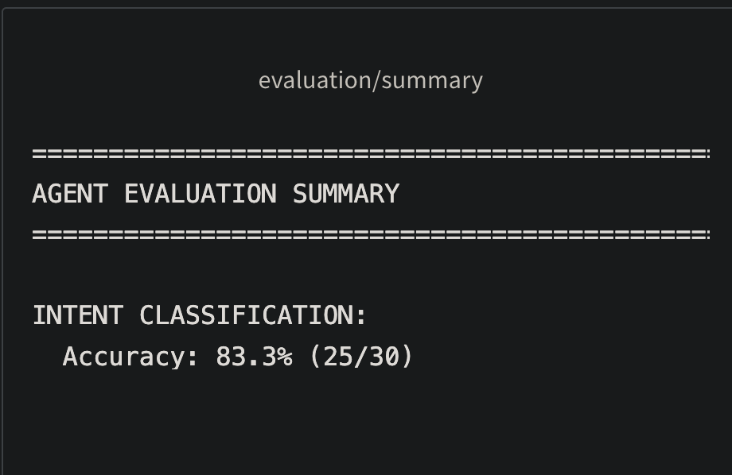
*Figure 2.4: Comparative summary of all agent performance metrics.*

#### PTO Agent
Tracks the specific workflow of PTO requests. We monitor:
*   **Intent Classification Confidence**: How sure was the agent that the user wanted PTO?
*   **Tool Usage**: Did the agent correctly call the `check_balance` tool before `submit_request`?
*   **Slot Filling**: Did the agent successfully extract "start date", "end date", and "reason" from the user's prompt?

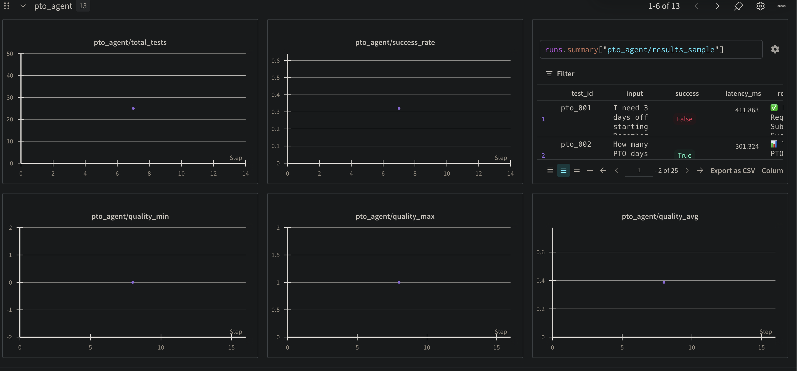
*Figure 2.5: Detailed traces and metrics for the PTO Agent.*

#### HR Ticket Agent
Monitors the creation, cancellation, and resolution of HR tickets.
*   **RAG Relevance**: We measure the cosine similarity distance of retrieved documents. Low similarity scores trigger alerts for "potentially irrelevant answers".
*   **Resolution Time**: The time between ticket creation and "resolved" status.
*   **Document Retrieval Count**: How many documents were needed to answer the question? (Too many might indicate poor indexing).

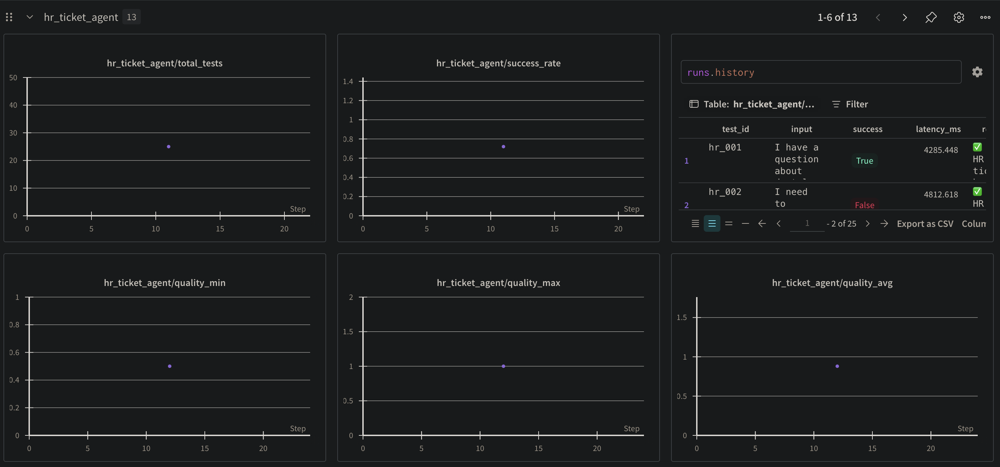
*Figure 2.6: HR Ticket Agent performance and tool usage attributes.*

#### Website Agent
Tracks the performance of the web scraper and content extractor.
*   **Scraping Success Rate**: Percentage of URLs successfully parsed.
*   **HTML Parsing Time**: Time taken to convert raw HTML to clean markdown for the LLM.
*   **Token Count of Content**: We monitor if scraped pages are too large, which would overflow the LLM's context window.

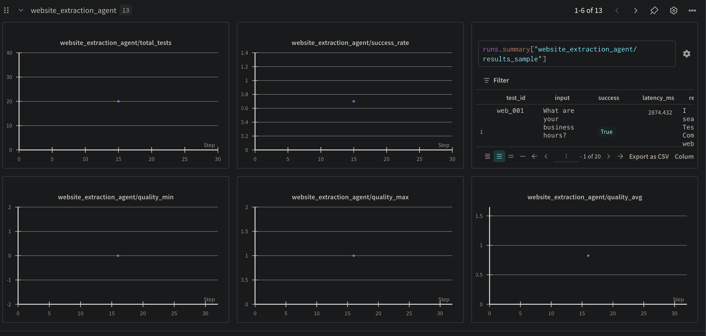
*Figure 2.7: Website extraction agent metrics.*

### 2.4 Core Model Evaluation
We also track the underlying LLM's performance.
*   **Hallucination Rate**: We use a custom "groundedness" score to estimate how much of the answer is supported by the retrieved context.
*   **Sentiment Analysis**: Monitoring the sentiment of user queries (frustrated users?) vs. agent responses (polite agent?).

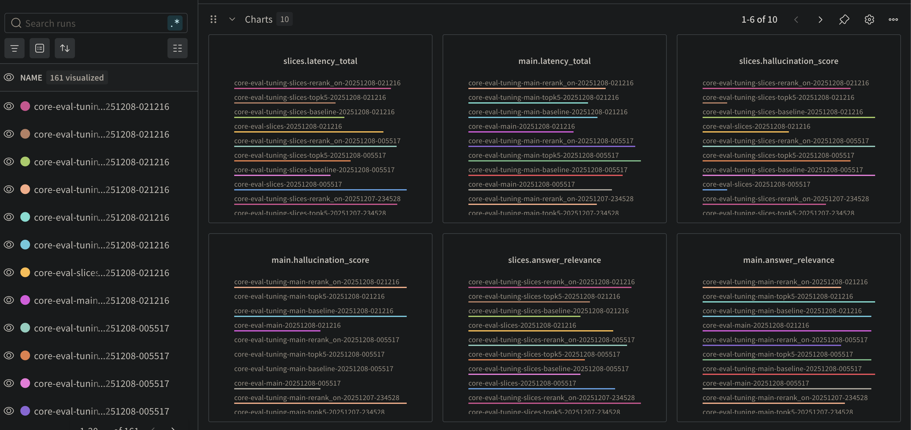
*Figure 2.8: Core model evaluation metrics (Part 1).*

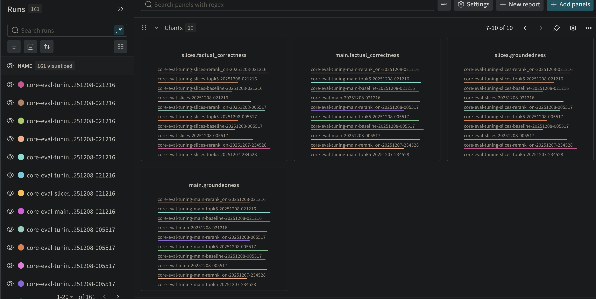
*Figure 2.9: Core model evaluation metrics (Part 2).*

---

## 3. Cloud Infrastructure Monitoring (GCP)

Google Cloud Monitoring gives us visibility into the operational state of our containers and databases. This is the "Engine Room" view.

### 3.1 Cloud Run (Compute)
We monitor our containerized application running on Cloud Run.
*   **Request Count**: Total incoming requests per second. Used to determine when to scale up.
*   **Container Instance Count**: Verifies auto-scaling. If we see request count go up but instance count stay flat, we have a scaling configuration issue.
*   **CPU & Memory Utilization**:
    *   **CPU**: High usage (>80%) triggers auto-scaling.
    *   **Memory**: High usage might indicate a memory leak in our Python application (e.g., pandas dataframes not being cleared).
*   **Startup Latency**: Time it takes for a new container to spin up (Cold Start). We optimize this to keep user wait times low.

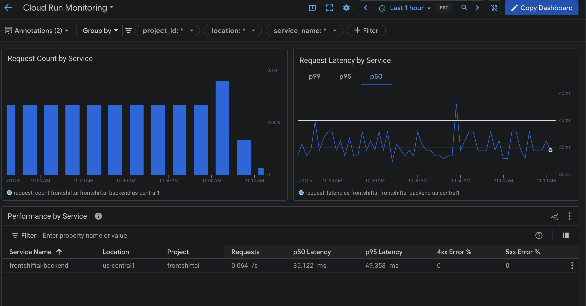
*Figure 3.1: Request counts and container instance scaling.*

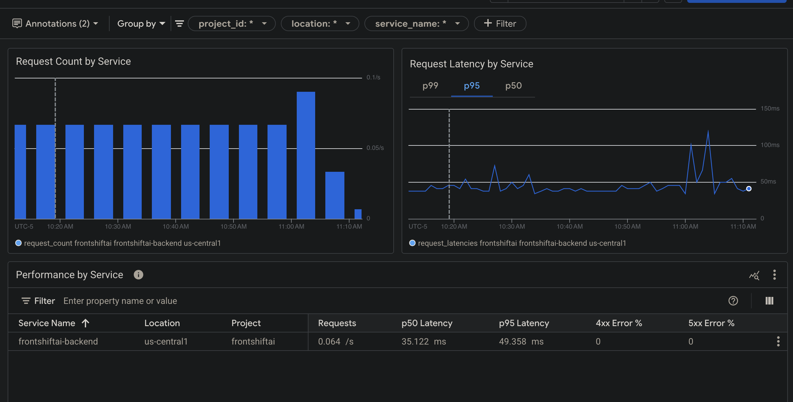
*Figure 3.2: CPU utilization metrics for Cloud Run services.*

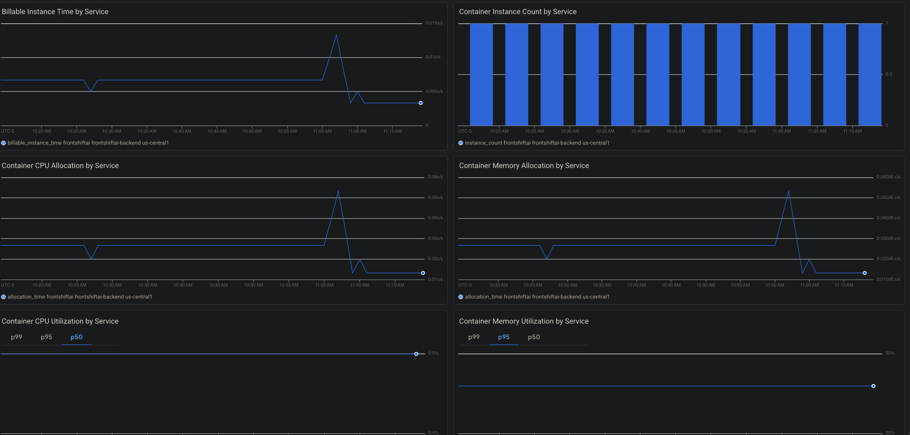
*Figure 3.3: Memory utilization and network I/O.*

### 3.2 Cloud SQL (Database)
Monitoring the health of our PostgreSQL database is critical.
*   **CPU Utilization**: Database CPU spikes usually indicate unoptimized queries (missing indexes).
*   **Storage Usage**: Alerts set at 80% capacity to prevent database freeze.
*   **Active Connections**: We monitor this against our `max_connections` limit. If this spikes, our connection pooling (SQLAlchemy) might be misconfigured.
*   **Transaction/Query Latency**: Which specific queries are slow? (e.g., `SELECT * FROM embeddings` is expensive).

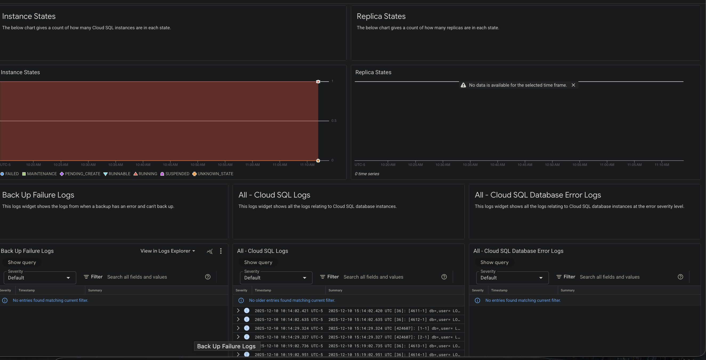
*Figure 3.4: General Cloud SQL instance health.*

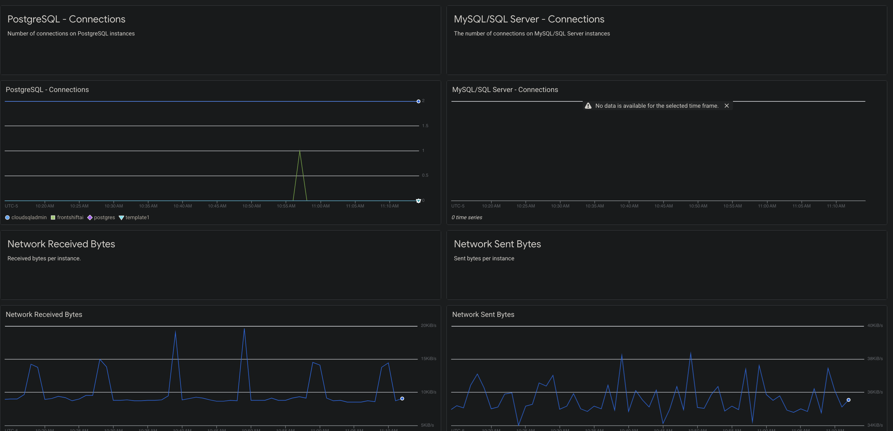
*Figure 3.5: Detailed PostgreSQL metrics including active connections and transaction rates.*

### 3.3 Production Overview & Logs
A unified view of the production environment within GCP.
*   **Log Explorer**: Aggregates `stdout` and `stderr` from all containers. We use structured logging (JSON) to easily filter logs by `severity="ERROR"` or `component="backend"`.
*   **Error Reporting**: Groups similar stack traces together so we know if 1000 errors are actually just 1 unique bug happening 1000 times.

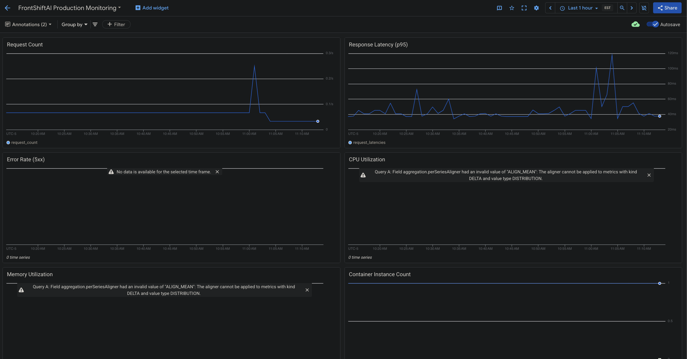
*Figure 3.6: Production environment overview in GCP.*

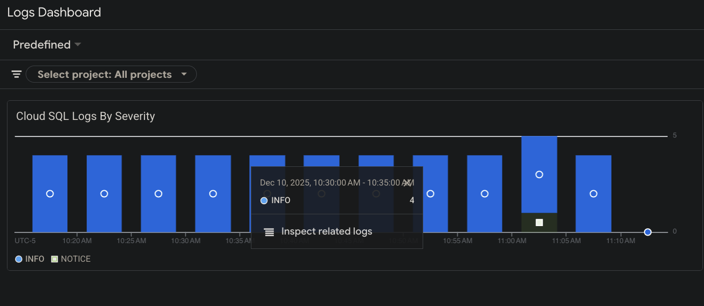
*Figure 3.7: Log Explorer view for tracing errors and system events.*

---

## 4. Admin & Multi-Tenancy Monitoring

To support our multi-tenant B2B Architecture, we provide specific monitoring views for both our internal Super Admins and the Company-level Admins.

### 4.1 Super Admin Dashboard
This high-level view allows our internal support team to monitor the health of all tenant companies simultaneously.
*   **Tenant Health**: Quickly identify if a specific company is experiencing API errors while others are fine.
*   **Global Usage Stats**: Track total API consumption across the platform to forecast costs.
*   **System Alerts**: Centralized view of all critical alerts (e.g., Database down) that affect multiple tenants.

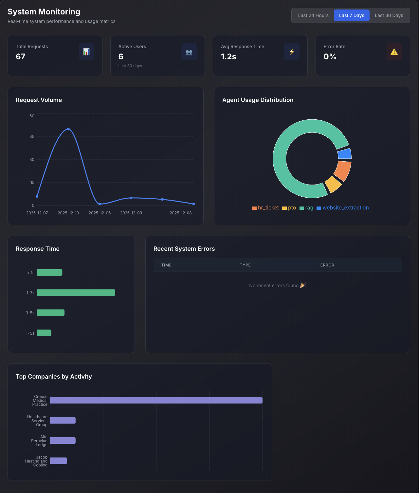
*Figure 4.1: Internal Super Admin dashboard for global oversight.*

### 4.2 Company Admin Dashboard
Each customer (e.g., TechCorp) gets a tailored view of their own usage.
*   **Usage Quotas**: Admins can see if they are approaching their monthly request limits.
*   **User Activity**: Identifying who are the "Power Users" within their organization.
*   **Feature Usage**: Understanding which agents (PTO, HR) are providing the most value to their employees.

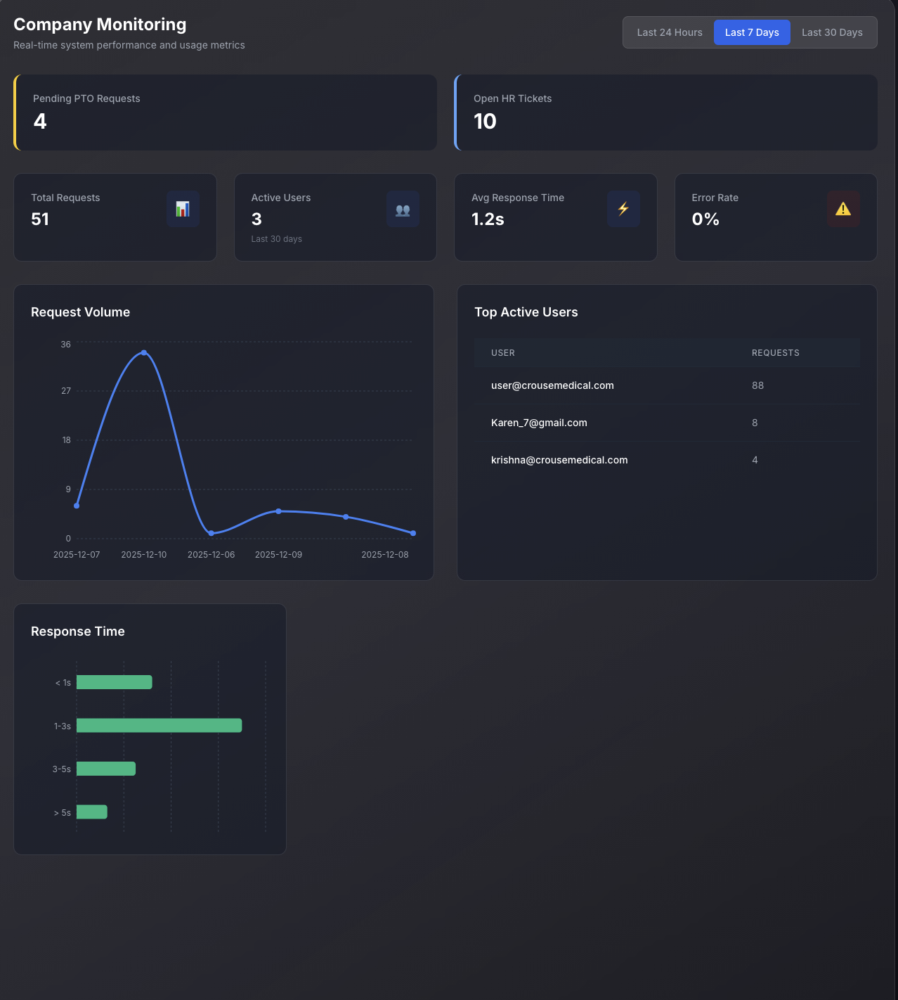
*Figure 4.2: Tenant-specific dashboard for company administrators.*

---

## 5. Summary & Improvements

### Summary
We have successfully implemented a robust "Full Stack" observability pipeline:
1.  **Infrastructure Level**: GCP Metrics ensure our servers stay up, scale with demand, and our database remains responsive. We rely on P99 latency and error rate alerts here.
2.  **Application Level**: W&B Traces ensure our code runs without errors and we can debug specific user sessions.
3.  **Semantic Level**: W&B Evaluations ensure our Agents are meaningful, accurate, and not hallucinating. This is the most critical layer for an AI application.
4.  **Business Level**: Admin dashboards provide transparency to our stakeholders and customers.

### Future Improvements
1.  **Unified Dashboard**: Currently, we have two separate places for metrics (GCP & W&B). We aim to export crucial GCP metrics into W&B for a "Single Pane of Glass" view.
2.  **Cost Monitoring**: Add specific dashboards for tracking the cost per query/agent execution to optimize API spending.
3.  **Automated Retraining Triggers**: Link W&B "Low Confidence" alerts directly to a dataset collection pipeline for future model fine-tuning.
4.  **Canary Deployments**: Use monitoring metrics to automatically roll back deployments if error rates spike in the first 5 minutes.
