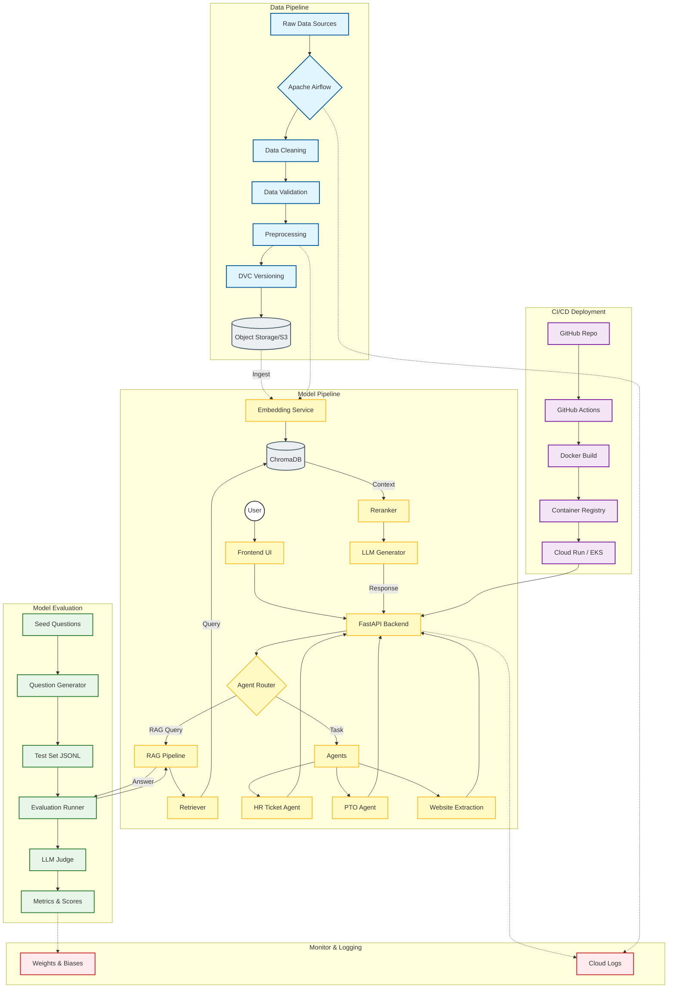

```mermaid
graph TD
    %% Define Styles
    classDef pipeline fill:#e1f5fe,stroke:#01579b,stroke-width:2px;
    classDef model fill:#fff9c4,stroke:#fbc02d,stroke-width:2px;
    classDef eval fill:#e8f5e9,stroke:#2e7d32,stroke-width:2px;
    classDef deploy fill:#f3e5f5,stroke:#7b1fa2,stroke-width:2px;
    classDef monitor fill:#ffebee,stroke:#c62828,stroke-width:2px;
    classDef storage fill:#eceff1,stroke:#455a64,stroke-width:2px,shape:cylinder;
    classDef user fill:#fff,stroke:#333,stroke-width:2px,shape:circle;

    %% Data Pipeline Swimlane
    subgraph Data_Pipeline [Data Pipeline]
        direction LR
        RawData[Raw Data Sources] --> Airflow{Apache Airflow}
        Airflow --> DataClean[Data Cleaning]
        DataClean --> DataVal[Data Validation]
        DataVal --> DataPre[Preprocessing]
        DataPre --> DVC[DVC Versioning]
        DVC --> S3[(Object Storage/S3)]
    end

    %% Model Pipeline Swimlane
    subgraph Model_Pipeline [Model Pipeline]
        direction TB
        User((User)) --> Frontend[Frontend UI]
        Frontend --> API[FastAPI Backend]
        
        API --> Router{Agent Router}
        
        %% RAG Flow
        Router -->|RAG Query| RAG_Pipe[RAG Pipeline]
        RAG_Pipe --> Retriever[Retriever]
        Retriever -->|Query| Chroma[(ChromaDB)]
        Chroma -->|Context| Reranker[Reranker]
        Reranker --> Generator[LLM Generator]
        Generator -->|Response| API
        
        %% Agent Flow
        Router -->|Task| Agents[Agents]
        Agents --> HR[HR Ticket Agent]
        Agents --> PTO[PTO Agent]
        Agents --> Web[Website Extraction]
        HR & PTO & Web --> API
        
        %% Embeddings
        S3 -.->|Ingest| Embed[Embedding Service]
        Embed --> Chroma
    end

    %% Model Evaluation Swimlane
    subgraph Model_Evaluation [Model Evaluation]
        direction LR
        Seed[Seed Questions] --> QGen[Question Generator]
        QGen --> TestSet[Test Set JSONL]
        TestSet --> EvalRunner[Evaluation Runner]
        EvalRunner --> RAG_Pipe
        RAG_Pipe -->|Answer| EvalRunner
        EvalRunner --> Judge[LLM Judge]
        Judge --> Metrics[Metrics & Scores]
    end

    %% CI/CD Deployment Swimlane
    subgraph Deployment [CI/CD Deployment]
        direction LR
        Git[GitHub Repo] --> Actions[GitHub Actions]
        Actions --> DockerBuild[Docker Build]
        DockerBuild --> ECR[Container Registry]
        ECR --> CloudRun[Cloud Run / EKS]
        CloudRun --> API
    end

    %% Monitor & Logging Swimlane
    subgraph Monitoring [Monitor & Logging]
        direction TB
        WandB[Weights & Biases]
        CloudWatch[Cloud Logs]
        
        Metrics -.-> WandB
        API -.-> CloudWatch
        Airflow -.-> CloudWatch
    end

    %% Cross-lane connections
    DataPre -.-> Embed
    
    %% Apply Styles
    class RawData,Airflow,DataClean,DataVal,DataPre,DVC pipeline;
    class Frontend,API,Router,RAG_Pipe,Retriever,Reranker,Generator,Agents,HR,PTO,Web,Embed model;
    class Seed,QGen,TestSet,EvalRunner,Judge,Metrics eval;
    class Git,Actions,DockerBuild,ECR,CloudRun deploy;
    class WandB,CloudWatch monitor;
    class S3,Chroma storage;
    class User user;
```
